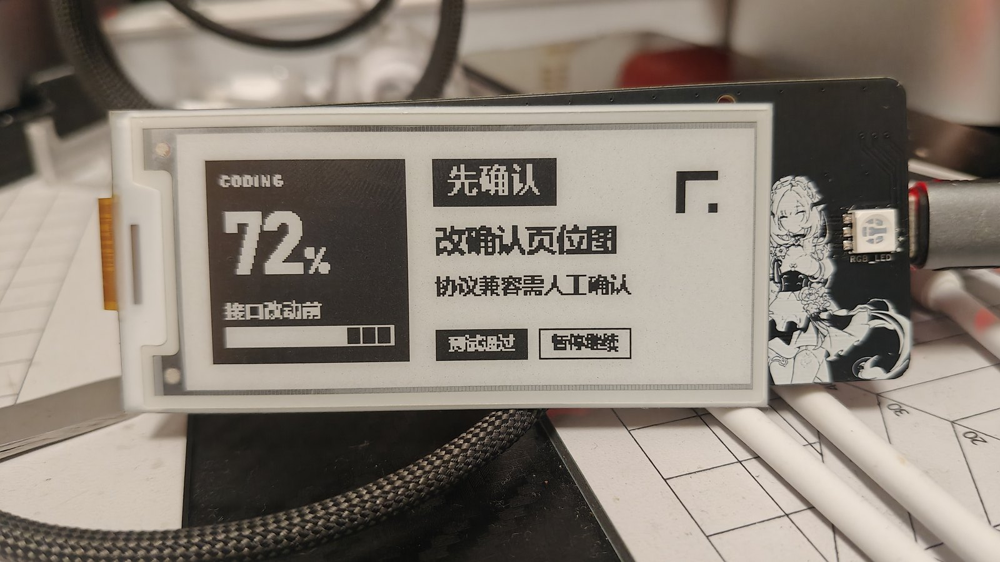
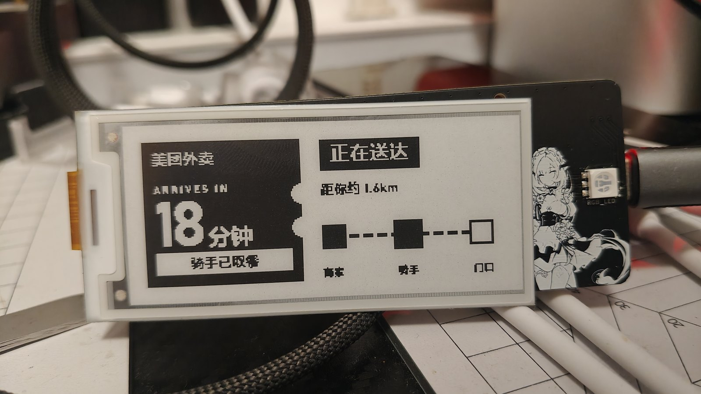
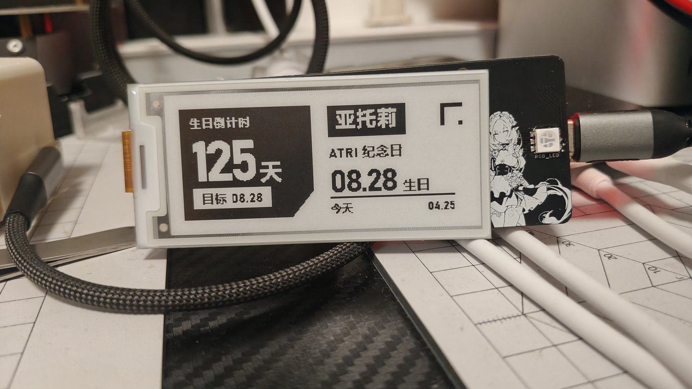

# NekoPaw 🐾

`NekoPaw`（项目名）是一个面向 `ESP32`（微控制器）的 `Arduino`（开发框架）库，用一组轻量 `HTTP API`（网页接口）把小屏设备暴露给 `AI Agent`（智能代理）使用。

现在可以把它理解成一条小屏闭环：

```text
AI Agent
  -> render skill
  -> preview PNG
  -> 1bpp bitmap
  -> bridge skill / HTTP API
  -> ESP32 device
```

也就是说，`render skill`（渲染技能）负责把内容做成适合墨水屏的小画面，`bridge skill`（桥接技能）负责把画面、确认请求、传感器和输出控制发给设备。

## 现在能做什么

- 显示文本和原始 `1bpp bitmap`（1 位图）
- 发起 `confirm`（确认）决策，并显示待确认、已确认、已取消、超时页面
- 读取传感器，例如电池电压
- 监听输入事件，例如按钮点击
- 控制输出，例如 `RGB LED`（彩色灯）和蜂鸣器
- 把 `Markdown`（标记文本）或 `scene json`（场景布局描述）渲染成小屏面板
- 通过 `flowText / pretext`（文本排版链）改善关键文本块的分行和绕图效果

## 快速开始

### 编译设备示例

```bash
cd examples/BasicDisplay
pio run -e airm2m_core_esp32c3
```

`examples/BasicDisplay`（基础显示示例）会读取本地 `platformio_override.ini`（本机配置），用于设置 `WiFi`（无线网络）、屏幕驱动和板卡环境。这个文件不要提交到仓库。

### 查询设备

```bash
python skill/bridge_cli.py --url http://192.168.31.198 device info
```

设备会返回屏幕尺寸、能力列表、传感器、按钮和输出能力。后续上传位图前，`bridge_cli.py`（桥接命令行）也会先检查位图大小是否和设备屏幕匹配。

### 显示文本或位图

```bash
python skill/bridge_cli.py display text --title "Greeting" --body "Hello NekoPaw"
python skill/bridge_cli.py display bitmap --input out/panel.bin
python skill/bridge_cli.py display state
```

### 生成小屏面板

```bash
python skill/render_cli.py scene --input scene.json --preview out/scene.png --bitmap out/scene.bin --bw-preview out/scene_bw.png
python skill/bridge_cli.py display bitmap --input out/scene.bin
```

如果要使用 `flowText / pretext`（文本排版链），需要安装前端依赖：

```bash
npm install
```

第一次使用浏览器截图渲染时，还需要安装 `Playwright Chromium`（浏览器运行时）：

```bash
python -m playwright install chromium
```

## 确认决策页

`confirm`（确认）支持两种方式：

- 文字模式：直接传标题、正文和按钮文案
- 位图模式：上传 `pending / confirmed / cancelled / timeout`（等待 / 确认 / 取消 / 超时）四张状态图

```bash
python skill/render_cli.py confirm-assets --title "Memory" --body "Clean memory now?" --output-dir out/confirm
python skill/bridge_cli.py display confirm create --assets-dir out/confirm
python skill/bridge_cli.py display confirm wait --id cfm_000001
```

设备侧约定：`BTN1`（按钮 1）确认，`BTN2`（按钮 2）取消。

## 小屏面板示例

最近验证过的面板类型包括：

- `Token`（令牌）用量
- 天气与纪念日倒计时
- 游戏服务器监控
- 外卖配送进度
- 磁盘和内存状态
- 服务器探针链路
- 价格行情卡片
- 编码进度建议和人工确认提醒

这些都走同一条链路：先生成预览图，再转成 `1bpp bitmap`（1 位图），最后通过桥接接口发到设备。

## 实机效果图

下面三张是 2.9 寸黑白墨水屏上的实机效果。页面方向使用项目自带的 `render skill`（渲染技能）和 `bridge skill`（桥接技能）完成，并参考 `Anthropic`（Anthropic）的 [`frontend-design`（前端设计技能）](https://github.com/anthropics/skills/tree/main/skills/frontend-design) 做视觉设计：先生成适合小屏的预览图，再转成 `1bpp bitmap`（1 位图）发送到设备。







## 项目结构

```text
src/                    Arduino library source
examples/BasicDisplay   ESP32 example sketch
skill/bridge_cli.py     HTTP bridge CLI
skill/render_cli.py     render CLI entry
skill/render/           render pipeline, templates, pretext bridge
skill/tests/            CLI and render tests
docs/SCENE_JSON.md      scene json schema and examples
```

更完整的协议、架构和阶段计划放在本地文档里；实时任务和优先级以 `GitHub Issues`（任务单）为准。

当前主任务入口：

- #1 渲染链路与 `Skill`（技能）升级：https://github.com/TruElysia02/NekoPaw/issues/1

## 开发验证

设备侧默认通过示例工程验证：

```bash
cd examples/BasicDisplay
pio run -e airm2m_core_esp32c3
```

命令行和渲染链测试：

```bash
python -m unittest discover -s skill/tests -p "test_*.py"
```

涉及真实屏幕、按钮、蜂鸣器或电源行为的改动，如果没有真机复测，需要在提交说明里写清楚验证边界。
